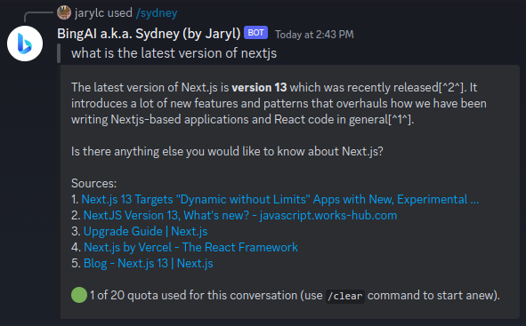

# cf-workers-bingai-sydney-discord-bot

## Description

Serverless Discord bot in webhook mode to quickly interface with [BingAI a.k.a Sydney](https://www.bing.com/new)'s using a reversed engineered API.

This is much slower than ChatGPT variants as there is no way to disable streaming mode (words generate one at a time) and I have to capture when the stream ends.

Note: This is mainly for personal use, if you would like to add features, do fork the repository. Do perform PRs back if you would be so kind!

## Prerequisites
- A Cloudflare account with Workers (at least free-tier) enabled
- Completed the [Discord Developers - Getting Started - Creating an App](https://discord.com/developers/docs/getting-started#creating-an-app) with the same scopes and have added the bot to your target server
- Logged in to Bing and grabbed the request cookie to https://edgeservices.bing.com/edgesvc/turing/conversation/create
    - Make sure a Success message is shown before grabbing the cookie
    - You can use your Browser's Developer Tools to extract this when visiting https://edgeservices.bing.com/edgesvc/turing/conversation/create
    - You likely need to periodically update this after it expires

## Getting Started
### Wrangler
1. Sign in to https://www.bing.com/ on the browser
2. Clone this repository
3. Run `npm ci` or `yarn install`
4. Replace `{DISCORD_TOKEN}` and `{DISCORD_APPLICATION_ID}` in the following `DISCORD_TOKEN={DISCORD_TOKEN} DISCORD_APPLICATION_ID={DISCORD_APPLICATION_ID} npx node src/register.js` and run it to register the bot commands
5. Run `npx wrangler secret put DISCORD_APPLICATION_ID` and set the Discord app's ID
6. Run `npx wrangler secret put DISCORD_PUBLIC_KEY` and set the Discord app's public key
7. Run `npx wrangler secret put DISCORD_TOKEN` and set the Discord bot's token
8. Run `npx wrangler secret put BING_COOKIE` and set the OpenAI API key
9. Add space-delimited user IDs to whitelist in `DISCORD_USERID_WHITELIST` in wrangler.toml
10. (Optional) To enable context, run `npx wrangler kv:namespace create session` and replace the ID of `BINGAI_SYDNEY_DISCORD_BOT_KV` wrangler.toml, else remove `kv_namespaces` block entirely from wrangler.toml
11. (Optional) Choose your `BING_CONVERSATION_STYLE` by commenting and uncommenting accordingly in wrangler.toml
12. Run `npx wrangler publish` to deploy to Cloudflare Workers
13. Set the `Interactions Endpoint URL` of your Discord application to the URL of the deployed worker

### (On cookie expiry) Renewing BING_COOKIE
1. Sign in to https://www.bing.com/ on the browser
2. Run `npx wrangler secret put BING_COOKIE` and set your latest Bing cookie request header on https://edgeservices.bing.com/edgesvc/turing/conversation/create
